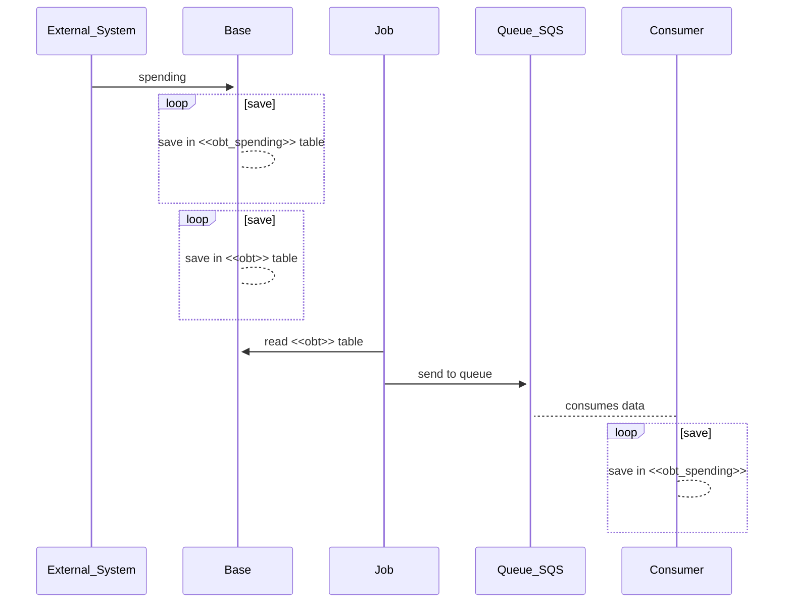

## Outboxtable

from: https://microservices.io/patterns/data/transactional-outbox.html

### Problem
How to reliably/atomically update the database and send messages/events?

### Forces
-   2PC is not an option
-   If the database transaction commits messages must be sent. Conversely, if the database rolls back, the messages must not be sent
-   Messages must be sent to the message broker in the order they were sent by the service. This ordering must be preserved across multiple service instances that update the same aggregate.

### Solution
A service that uses a relational database inserts messages/events into an _outbox_ table (e.g. `MESSAGE`) as part of the local transaction. An service that uses a NoSQL database appends the messages/events to attribute of the record (e.g. document or item) being updated. A separate _Message Relay_ process publishes the events inserted into database to a message broker.


### My solution

I created three separeted modules, the first one: **base**, has an API rest that receives a post:
```
curl --location --request POST '<<HOST>>:8081/api/v1/spending' \
--header 'Content-Type: application/json' \
--data-raw '{
"identity":"AB1",
"name":"Martin",
"surname":"Robi",
"amount":51.3
}'

```
This will be recorded in two tables: **obt_spending**, and other table that will be used for the job, called: **obt**.

The second module: **job**, will read from that database and the table mentioned before, and post that message in a **SQS queue**. 

The third module: **consumer**, will pick that message posted in the queue and will save that information in their database.



### Docker

Each module can run in a differente instance, and can be pulled in my docker hub, as:

Module: **base**
    
    docker run --net first-app --name outboxtable-base -p 8081:8080 -d mdymen85/outboxtable-base:latest

Module: **job**
    
    docker run --name outboxtable-job -p 8080:8080 -e MYSQL_HOST=<<IP_DESTINY>> -d mdymen85/outboxtable-job:latest

Module: **consumer**
    
    docker run --net first-app --name outboxtable-consumer -p 8081:8080 -d mdymen85/outboxtable-consumer:latest

### Cloudformation

There is a file that can be used to deploy all the stack in the aws


